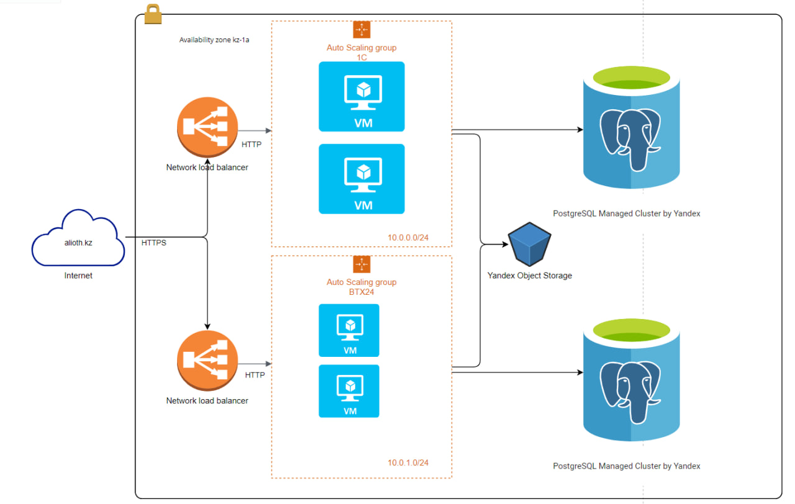

This diagram illustrates a cloud infrastructure setup in the Yandex Cloud environment, specifically within the kz-1a availability zone. Here’s a breakdown of the components:

Internet Access:

The alioth.kz domain represents external internet access to the infrastructure.
Network Load Balancer:

Two Network Load Balancers (NLBs) handle inbound traffic.
Traffic from the internet arrives via HTTPS and is distributed to virtual machines (VMs) over HTTP.
Auto Scaling Groups:

1C Auto Scaling Group:
This group contains two virtual machines within the subnet 10.0.0.0/24.
BTX24 Auto Scaling Group:
Another group with two virtual machines, but within the subnet 10.0.1.0/24.
These groups allow the infrastructure to scale automatically based on demand.
Database and Object Storage:

PostgreSQL Managed Clusters:
Two PostgreSQL databases managed by Yandex, likely serving different purposes for the 1C and BTX24 applications.
Yandex Object Storage:
This storage component serves as centralized storage, potentially for files and backups, and is accessible to both auto-scaling groups.
In summary, the diagram depicts a scalable and distributed cloud environment in Yandex Cloud with load balancing, database management, and storage services, allowing the infrastructure to handle high availability and scalability for the 1C and BTX24 applications.
